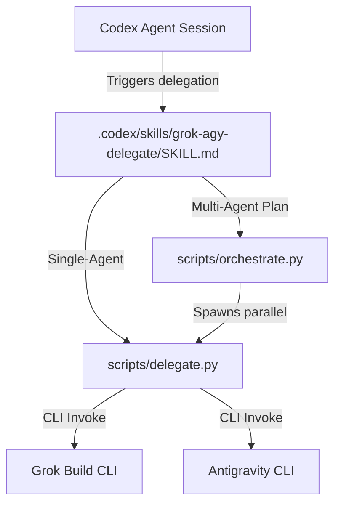

# Agent Architecture and Delegation

This repository defines the agent role maps and provides capabilities for delegating repository work from Codex to external agent runtimes—specifically **Grok Build** (`grok` CLI) and **Antigravity** (`agy` CLI).

For operational details and setup, see [Grok/Antigravity Delegation Guide](docs/grok-agy-delegation.md).

---

## Canonical Role Map

Project agents are mapped across different provider surfaces. The canonical roles defined in this repository under `.codex/agents/` are mirrored into `.grok/agents/` and the Antigravity plugin under `.agents/plugins/home-codex-agents/`.

| Role | Responsibility | Primary Model |
| :--- | :--- | :--- |
| **architecture** | High-level structure and GitOps system design | `gpt-5.4` / `grok-4.5` / `Claude Opus 4.6 (Thinking)` |
| **development** | Implementation, maintenance, and local tool execution | `gpt-5.4-mini` / `grok-composer-2.5-fast` / `Gemini 3.5 Flash (Medium)` |
| **devops** | CI/CD, deployment, and operational reliability | `gpt-5.4` / `grok-4.5` / `Claude Opus 4.6 (Thinking)` |
| **devops-subagent** | Focused CI/CD and deployment support | `gpt-5.4` / `grok-4.5` / `Claude Opus 4.6 (Thinking)` |
| **documentation** | Runbooks, guides, and deep technical reference docs | `gpt-5.4` / `grok-4.5` / `Claude Opus 4.6 (Thinking)` |
| **docs-scribe** | Lightweight README and usage-doc maintenance | `gpt-5-mini` / `grok-composer-2.5-fast` / `Gemini 3.5 Flash (Medium)` |
| **debugger** | Bug isolation, root-cause analysis, and reproduction | `gpt-5.4` / `grok-4.5` / `Claude Opus 4.6 (Thinking)` |
| **manager** | Orchestration, planning, and task handoff reconciliation | `gpt-5.4` / `grok-4.5` / `Claude Opus 4.6 (Thinking)` |
| **product-development** | Requirement translation and release planning | `gpt-5.4` / `grok-4.5` / `Claude Opus 4.6 (Thinking)` |
| **testing** | Focused test execution and CI-readiness validation | `gpt-5.4-mini` / `grok-composer-2.5-fast` / `Gemini 3.5 Flash (Medium)` |
| **gitops-architect** | ArgoCD manifest planning and infrastructure alignment | `gpt-5.4` / `grok-4.5` / `Claude Opus 4.6 (Thinking)` |
| **security-auditor** | Diff risk audits and configuration drift review | `o2-preview` / `grok-4.5` / `Claude Opus 4.6 (Thinking)` |
| **validation-runner** | Codex validation and environment verification | `gpt-5.3-codex-spark` / `grok-composer-2.5-fast` / `Gemini 3.5 Flash (Low)` |
| **junior** | Boilerplate generation, docs, and low-risk support | `gpt-5.3-codex-spark` / `grok-composer-2.5-fast` / `Gemini 3.5 Flash (Low)` |

---

## The Delegation Capability

The repository contains a specialized Codex delegation skill located in [.codex/skills/grok-agy-delegate/SKILL.md](.codex/skills/grok-agy-delegate/SKILL.md). This skill allows Codex to securely offload execution workloads.



### 1. The Single-Agent Wrapper (`scripts/delegate.py`)
The delegation wrapper standardizes execution commands across providers. It maps generic roles to their provider-specific configurations and executes the corresponding CLI executable (`grok` or `agy`) locally.

- **Execution Mode**: Uses local user filesystem permissions and credentials.
- **Safety**: Integrates dry-run checks and enforces strict timeouts.

### 2. The Plan Orchestrator (`scripts/orchestrate.py`)
For complex, multi-step operations, Codex creates a structured plan in JSON and executes it via the orchestrator. The orchestrator:
- Parses task dependencies.
- Executes ready tasks concurrently (subject to `--max-parallel`).
- Captures and logs outputs.
- Invokes a **manager** role to review task outputs, resolve conflicts, and output a final reconciled manifest.

### 3. The `.agent-runs` Handoff Directory
Coordinated multi-agent execution generates a run directory under `.agent-runs/<run-id>/` (e.g. `.agent-runs/20260710T124500Z-8b2a3c7d/`).

```
.agent-runs/<run-id>/
├── plan.json                # Copy of the input orchestrator plan
├── run.json                 # Reconciled execution manifest (status, exit codes, file paths)
├── tasks/
│   ├── <task-id-1>/
│   │   ├── prompt.txt       # Combined worker system prompt and context
│   │   ├── output.txt       # Worker stdout (durable handoff)
│   │   └── stderr.txt       # Worker stderr logs
│   └── <task-id-2>/
│       ├── prompt.txt
│       ├── output.txt
│       └── stderr.txt
└── manager/
    ├── prompt.txt           # Manager reconciliation instruction
    ├── output.txt           # Final manager summary
    └── stderr.txt           # Manager CLI error logs
```

### 4. Cross-Provider Communication Protocol
Grok and Antigravity **do not share a direct network or API communication protocol**. They are decoupled runtimes. 

Instead, state and context are handed off strictly through **physical files in the `.agent-runs` directory**:
1. When a task completes, its stdout is persisted to `tasks/<task-id>/output.txt`.
2. Any downstream task that depends on it has the path of that `output.txt` injected into its prompt.
3. The downstream agent reads the dependency output from the local filesystem to capture context before executing.
4. Finally, the manager agent reads all generated output files to reconcile the final state.

### 5. Provider and Model Selection
Provider and model selection can be specified explicitly at the plan or task level. When not overridden, the orchestrator and wrapper apply mappings configured in [.agents/plugins/home-codex-agents/rules/model-equivalence.md](.agents/plugins/home-codex-agents/rules/model-equivalence.md):

- **High-Complexity Roles** (e.g., `architecture`, `debugger`):
  - Grok: `grok-4.5`
  - Antigravity: `Claude Opus 4.6 (Thinking)`
- **Medium-Complexity Roles** (e.g., `development`, `testing`):
  - Grok: `grok-composer-2.5-fast`
  - Antigravity: `Gemini 3.5 Flash (Medium)`
- **Low-Risk / Spark Roles** (e.g., `validation-runner`, `junior`):
  - Grok: `grok-composer-2.5-fast`
  - Antigravity: `Gemini 3.5 Flash (Low)`
