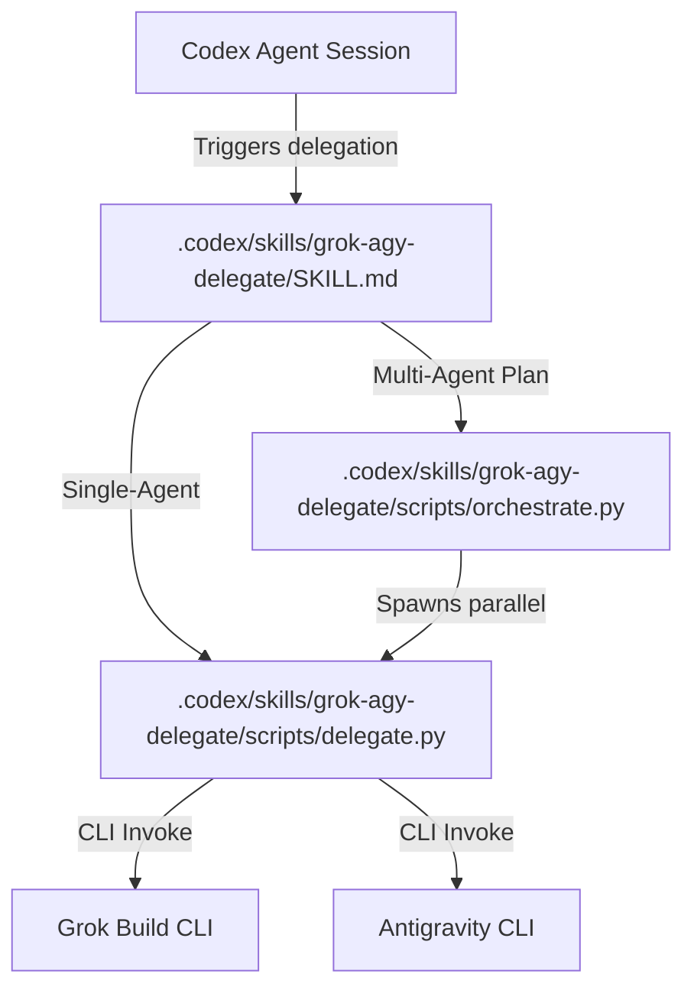

# Agent Architecture and Delegation

This repository defines the agent role maps and provides capabilities for delegating repository work from Codex to external agent runtimes—specifically **Grok Build** (`grok` CLI) and **Antigravity** (`agy` CLI).

For operational details and setup, see [Grok/Antigravity Delegation Guide](docs/grok-agy-delegation.md).

---

## Layered project instructions

Instructions are intentionally layered. Do not hand-edit generated surfaces.

| Layer | Path | Who loads it |
| :--- | :--- | :--- |
| **Cross-provider contract** | Root `AGENTS.md` (this file) | Grok (via `agents_md: true` on generated agents); Codex/session rules; humans |
| **Canonical role definitions** | `.codex/agents/*.agent.md` | Codex; also referenced by Grok roles via `prompt_file` in `.grok/roles/*.toml` |
| **Codex agent index** | `.codex/agents/AGENTS.md` | Codex operators; links here and to the skill |
| **Generated Grok agents** | `.grok/agents/*.md`, `.grok/roles/*.toml` | `grok --agent <role>` |
| **Generated Antigravity plugin** | `.agents/plugins/home-codex-agents/` | `agy --agent <role>` |

### Grok `agents_md` behavior

`scripts/sync_agent_surfaces.py` sets `agents_md: true` on every generated
`.grok/agents/<role>.md` file. With that flag, Grok Build injects repository
project-rule files into the session (root `AGENTS.md` / `Agents.md`, and any
deeper directory rules when the working tree uses them). Role-specific behavior
still comes from the agent body.

Prefer one root file named `AGENTS.md`. On case-insensitive filesystems,
`Agents.md` and `AGENTS.md` are the same file; on case-sensitive volumes, keep a
single casing so discovery stays consistent.

### Antigravity

Antigravity does **not** auto-load root `AGENTS.md`. Sync generates
`.agents/plugins/home-codex-agents/rules/repo-agents.md` as a short constitution
pointer for agy sessions. Prefer putting durable cross-provider rules here in
root `AGENTS.md`, and regenerate the plugin after role changes.

### Regenerating surfaces

```bash
python3 scripts/sync_agent_surfaces.py
python3 scripts/sync_agent_surfaces.py --check   # exit non-zero if generated trees drift
```

---

## Agent Workflow

- **PR CI Enforcement Hook:** When opening a PR, always wait for the GitHub Actions CI checks to pass (e.g., using `gh pr checks <id> --watch`) before finishing your task. If the checks fail, investigate the logs, push a fix, and verify it passes.
- **Commit Signing Workflow:** Ensure Git GPG/SSH commit signing is configured and uses the default global signing key (e.g., from Bitwarden/ssh-agent). Make sure your SSH agent/vault is unlocked when tasks are running so commits can be signed successfully without blocking.

---

## Canonical Role Map

Project agents are mapped across different provider surfaces. The canonical roles defined in this repository under `.codex/agents/` are mirrored into `.grok/agents/` and the Antigravity plugin under `.agents/plugins/home-codex-agents/`.

| Role | Responsibility | Primary Model |
| :--- | :--- | :--- |
| **architecture** | High-level structure and GitOps system design | `gpt-5.6-sol-xhigh` / `grok-4.5` / `Claude Opus 4.6 (Thinking)` |
| **development** | Implementation, maintenance, and local tool execution | `gpt-5.6-terra-high` / `grok-composer-2.5-fast` / `Gemini 3.5 Flash (Medium)` |
| **devops** | CI/CD, deployment, and operational reliability | `gpt-5.6-sol` / `grok-4.5` / `Claude Opus 4.6 (Thinking)` |
| **devops-subagent** | Focused CI/CD and deployment support | `gpt-5.6-sol` / `grok-4.5` / `Claude Opus 4.6 (Thinking)` |
| **documentation** | Runbooks, guides, and deep technical reference docs | `gpt-5.6-terra` / `grok-composer-2.5-fast` / `Gemini 3.5 Flash (Medium)` |
| **docs-scribe** | Lightweight README and usage-doc maintenance | `gpt-5.6-luna-high` / `grok-composer-2.5-fast` / `Gemini 3.5 Flash (Medium)` |
| **debugger** | Bug isolation, root-cause analysis, and reproduction | `gpt-5.6-sol-medium` / `grok-4.5` / `Claude Opus 4.6 (Thinking)` |
| **manager** | Orchestration, planning, and task handoff reconciliation | `gpt-5.6-sol` / `grok-4.5` / `Claude Opus 4.6 (Thinking)` |
| **product-development** | Requirement translation and release planning | `gpt-5.6-sol` / `grok-4.5` / `Claude Opus 4.6 (Thinking)` |
| **testing** | Focused test execution and CI-readiness validation | `gpt-5.6-terra` / `grok-composer-2.5-fast` / `Gemini 3.5 Flash (Medium)` |
| **gitops-architect** | ArgoCD manifest planning and infrastructure alignment | `gpt-5.6-sol-high` / `grok-4.5` / `Claude Opus 4.6 (Thinking)` |
| **security-auditor** | Diff risk audits and configuration drift review | `gpt-5.6-sol` / `grok-4.5` / `Claude Opus 4.6 (Thinking)` |
| **validation-runner** | Codex validation and environment verification | `gpt-5.6-luna` / `grok-composer-2.5-fast` / `Gemini 3.5 Flash (Low)` |
| **junior** | Boilerplate generation, docs, and low-risk support | `gpt-5.6-luna-high` / `grok-composer-2.5-fast` / `Gemini 3.5 Flash (Medium)` |
| **qa** | End-to-end validation, requirement checks, and logical consistency | `gpt-5.6-sol-medium` / `grok-4.5` / `Claude Opus 4.6 (Thinking)` |

---

## The Delegation Capability

The repository contains a specialized Codex delegation skill located in [.codex/skills/grok-agy-delegate/SKILL.md](.codex/skills/grok-agy-delegate/SKILL.md). This skill allows Codex to securely offload execution workloads.



### 1. The Single-Agent Wrapper (`.codex/skills/grok-agy-delegate/scripts/delegate.py`)
The delegation wrapper standardizes execution commands across providers. It maps generic roles to their provider-specific configurations and executes the corresponding CLI executable (`grok` or `agy`) locally.

- **Execution Mode**: Uses local user filesystem permissions and credentials.
- **Safety**: Integrates dry-run checks and enforces strict timeouts.

### 2. The Plan Orchestrator (`.codex/skills/grok-agy-delegate/scripts/orchestrate.py`)
For complex, multi-step operations, Codex creates a structured plan in JSON and executes it via the orchestrator. The orchestrator:
- Parses task dependencies and detects cycles at plan load time.
- Executes ready tasks concurrently (subject to `--max-parallel`).
- **Skips dependents** when a prerequisite fails, times out, or was itself skipped.
- Captures and logs outputs under `.agent-runs/<run-id>/`.
- Invokes a **manager** role to review task outputs, resolve conflicts, and output a final reconciled manifest.

Default provider when a plan omits `provider` is **`agy`**. Tasks and the manager may override provider/model.

### 3. The `.agent-runs` Handoff Directory
Coordinated multi-agent execution generates a run directory under `.agent-runs/<run-id>/` (e.g. `.agent-runs/20260710T124500Z-8b2a3c7d/`). This directory is listed in `.gitignore` because runs are local execution artifacts.

```
.agent-runs/<run-id>/
├── plan.json                # Copy of the input orchestrator plan
├── run.json                 # Reconciled execution manifest (status, exit codes, file paths)
├── tasks/
│   ├── <task-id-1>/
│   │   ├── prompt.txt       # Combined worker system prompt and context
│   │   ├── output.txt       # Worker stdout (durable handoff)
│   │   └── stderr.txt       # Worker stderr logs
│   └── <task-id-2>/
│       ├── prompt.txt
│       ├── output.txt
│       └── stderr.txt
└── manager/
    ├── prompt.txt           # Manager reconciliation instruction
    ├── output.txt           # Final manager summary
    └── stderr.txt           # Manager CLI error logs
```

### 4. Cross-Provider Communication Protocol
Grok and Antigravity **do not share a direct network or API communication protocol**. They are decoupled runtimes. 

Instead, state and context are handed off strictly through **physical files in the `.agent-runs` directory**:
1. When a task completes, its stdout is persisted to `tasks/<task-id>/output.txt`.
2. Any downstream task that depends on it has the path of that `output.txt` injected into its prompt.
3. The downstream agent reads the dependency output from the local filesystem to capture context before executing.
4. If an upstream task is `failed`, `timed-out`, or `skipped`, dependents are marked `skipped` and are not executed.
5. Finally, the manager agent reads all generated output files to reconcile the final state.

### 5. Provider and Model Selection
Provider and model selection can be specified explicitly at the plan or task level. When not overridden, the orchestrator and wrapper apply mappings configured in [.agents/plugins/home-codex-agents/rules/model-equivalence.md](.agents/plugins/home-codex-agents/rules/model-equivalence.md):

- **High-Complexity Roles** (e.g., `architecture`, `debugger`):
  - Grok: `grok-4.5`
  - Antigravity: `Claude Opus 4.6 (Thinking)`
- **Medium-Complexity Roles** (e.g., `development`, `testing`):
  - Grok: `grok-composer-2.5-fast`
  - Antigravity: `Gemini 3.5 Flash (Medium)`
- **Low-Risk / Spark Roles** (e.g., `validation-runner`, `junior`):
  - Grok: `grok-composer-2.5-fast`
  - Antigravity: `Gemini 3.5 Flash (Low)`
